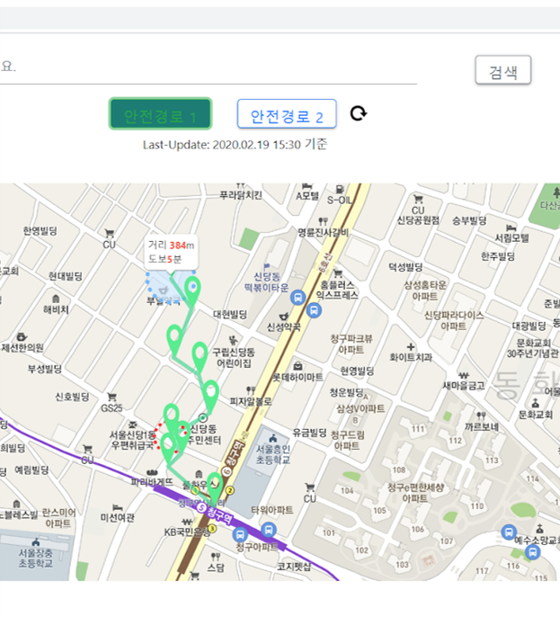

# web_portfolio

https://haeunnam.github.io/web_portfolio/

# 🎇 깨달음

<br>

#### - 위치를 먼저 생각하는게 고생을 덜 한다.

####  - readme 쓰는걸 생각 못해서 중간 기록이 없다.. 리드미 익숙해지기.. 플젝할때 매일매일 적어, 일자별로 작성해서 관리하기

#### - 박스배치 유념 필수, 잘 안되면 div 추가해보기..  

<br>

 내용 채우기가 더 어렵다..ㅎ

<br>

<br>

## 📌삽질 1 : 메인이미지 만들기

<br>

그림이랑  글씨를 같이 보이게하려니까 되지 않았다...

메인부터 어려움에 봉착..

<br>

스터디장님께 질문했더니 img 태그말고 header 요소에다가 이미지를 연결한 방법을 추천하셨다.

header에 연결했는데.. 이제는 글자가 문제였다.

뒤에 이미지가 있으니, 글자가 제대로 보이지 않아서 애를 많이 먹었다ㅠㅠ


<br>

<br>

1) **filter: grayscale과 opacity를 주는 방법**으로 해봤는데, opacity 때문에 글자도 투명해져서 실패ㅠ

<br>

2) 글자 뒤에 흰 바탕 깔도록 해서 일단 글자가 잘 보이도록은 했지만 마음에 들지 않았음 ㅠㅠ


3) 그러다가 찾은 방법이 바로 linear-gradient로  배경이미지에 검은색 그라데이션을 적용하니 깔끔하게 완성이 되었다.


<br>

아래는 메인 이미지에 적용한 css로 나중에도 자주 쓸 것 같아 첨부해 놓았다.

<br>

```css
header {
  height: 900px;
  background: linear-gradient(rgba(0,0,0,0.6),rgba(0,0,0,0.3)), url('img/main.jpg');
  background-repeat: no-repeat;
  background-position: center center;
  background-size: cover;
  width: 100%;
  display: flex;
  justify-content:center;
  align-items: center;
  flex-flow:column;
  text-align:center;
  color: #fff;
}
```

<br><br>

<br>

## 📌삽질 2 : 모달+캐러셀(feat. 반응형 웹)

<br>

모달 창 안에 캐러셀을 넣으면서  참 많은 문제들을 맞이했다...

<br>

**문제 1)** 사진의 크기가 다 달라서 모달 안에 사진의 크기가 제각각

**문제 2)** 옆으로 넘기는 버튼이 너무 커서 사진을 가림

**문제 3)** 화면사이즈가 바뀌면 박스에서 사진이 튀어나옴

<br>

위에서 언급한 세가지 문제 모두, 모달안에 사진을 넣으면서 시작된 문제이자 유기적으로 연결된 문제였다... 부들부들ㅎㅎㅎ

<br>

**문제 1**은 img를 감싸는 div태그에다 width와 height 값을 지정해서 해결했다.  **하지만, 해결한게 아니였다** 이때의 해결방법이 문제 3을 야기할 줄은 이땐 몰랐다..

<br>

**문제 2**는 버튼의 크기를 바꿔줘야 했다.  bootstrap에서 기본적으로 설정되어 있는 버튼은 크기가 커 화면에 은근히 거슬려 자그마한 버튼으로 만들어줘야 했다. 그래서 button class에 적용된 carousel-control-prev 를 지우고, 위치 지정을 다시 했다.

 


아래와 같이 button class 에"position-absolute bottom-0 start-0 bg-secondary" 을 추가했다.

```html
			<button class="position-absolute bottom-0 start-0 bg-secondary" type="button" data-bs-target="#carouselExampleControls1"  data-bs-slide="prev">
              <span class="carousel-control-prev-icon" aria-hidden="true"></span>
              <span class="visually-hidden">Previous</span>
            </button>
            <button class="position-absolute bottom-0 end-0 bg-secondary" type="button" data-bs-target="#carouselExampleControls1"  data-bs-slide="next">
              <span class="carousel-control-next-icon" aria-hidden="true"></span>
              <span class="visually-hidden">Next</span>
            </button>
```


양쪽 아래로 버튼을 이동시켜 버튼이 사진을 가리는 문제는 해결했다!!

<br>

**문제 3** 은 화면사이즈를 줄였을때 사진이미지가 튀어나오는 현상이었다.

 **문제 1에서** **"이미지를 감싸는 태그"**에 크기를 지정해서 생긴 문제였다. 

<br>

#### **원인**

1) 화면에 따라 조절되도록 하려면 width값을 지정하지 말아야했다.

2) 이미지에다가 width, height 값을을 적용해야 했다.(감싸는 태그X)

<br>

그래서 찾아보니 max-width:100%와 height:auto 를 주로 사용하는 걸 알 수 있었다. 하지만, 높이가 일정해야 모달박스의 크기도 일정하기에 height auto를 사용할 수 없었다.

<br>

#### **해결법**

img를 감싸는 태그의 class 적용을 지운 뒤, **img 태그에다 width 100%와 height 값 지정으로 해결했다!**

<br>

```html

```


해결하고나서는 약간 허무했다... 이거 때문에 동네방네 검색하며 원인을 찾았는데, 이렇게 쉽게 해결?하다니ㅎㅎ

아마 다시는 안 잊지 않을까..?ㅎㅎ 

<br><br>

## 마치며

배치도 많이고생했는데, 배치도 그렇고, 이것도 그렇고 사용 방법?을 제대로 몰랐을 때 난관에 봉착하는 경우가 많다. 그리고 사용방법을 제대로 익히려면 역시 직접 구현해보며 많이 찾아보는 수 밖에 없는 것 같다. 개발자의 숙명이지 않을까...??ㅠ


<br><br>

